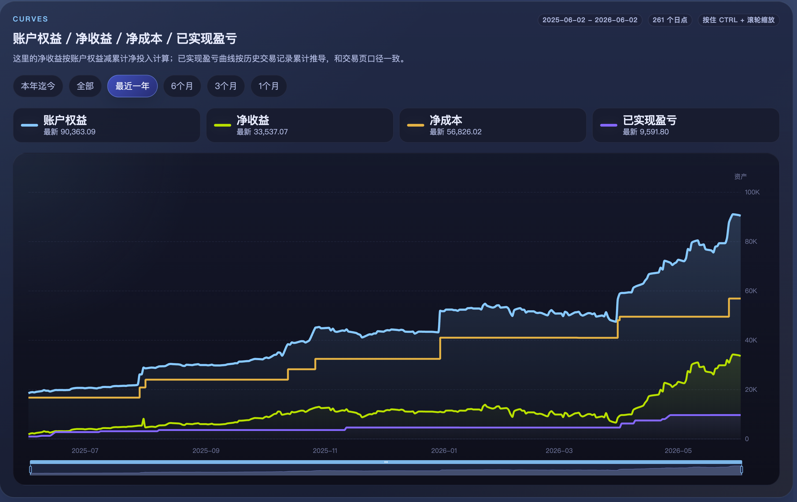
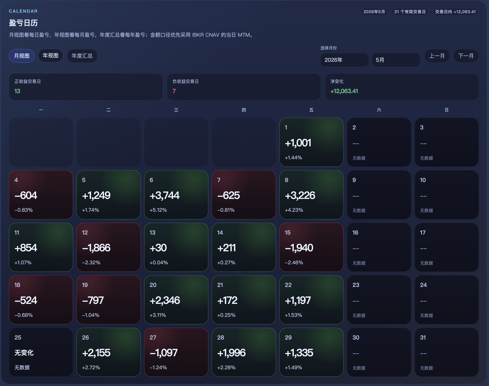
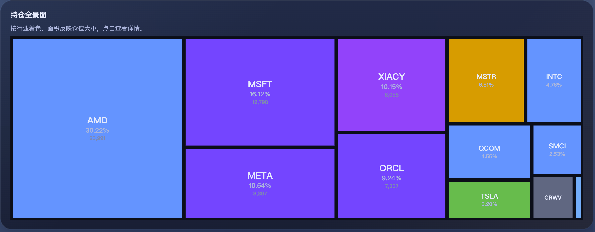
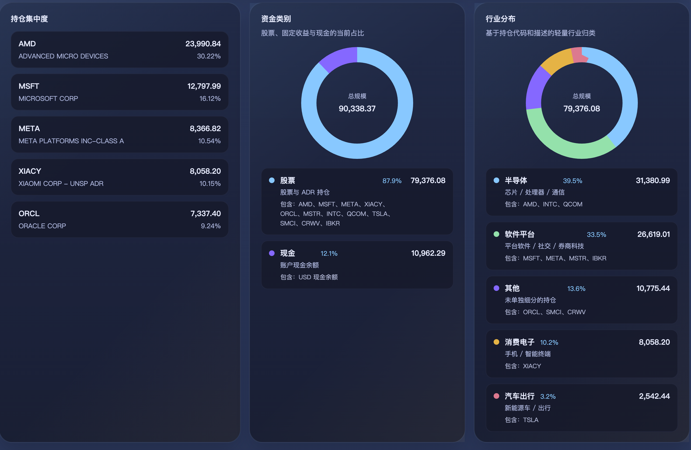
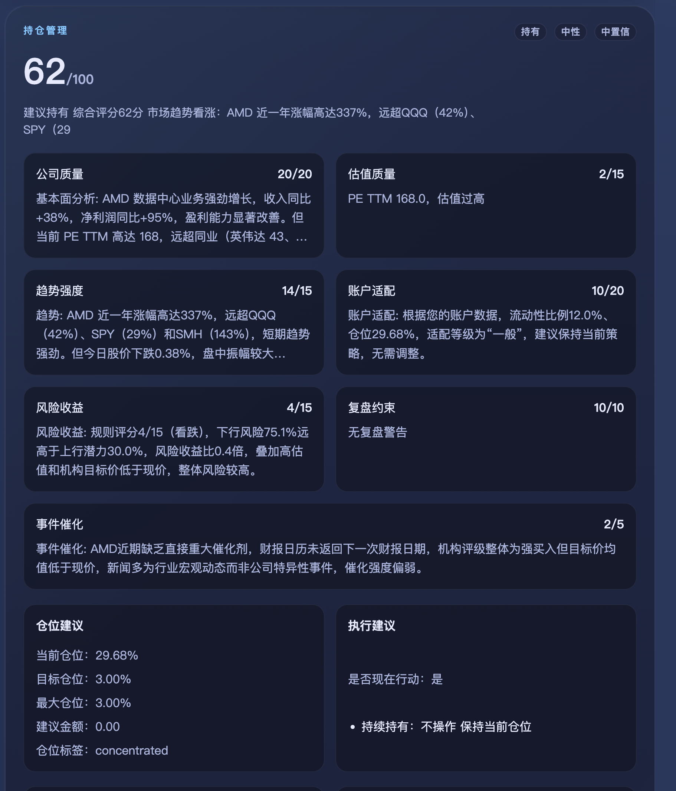
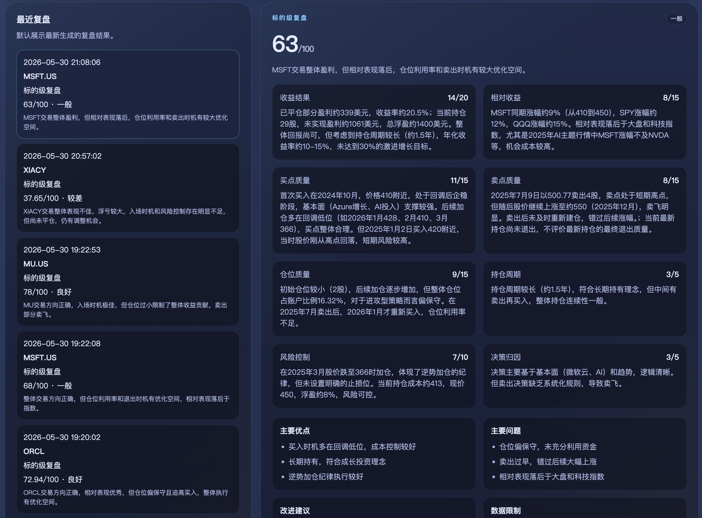

# IBKR Trade Agent

[中文文档](README.zh-CN.md)

IBKR Trade Agent is an **IBKR** account analytics and AI research workspace for a **portfolio dashboard**, **trade review**, **decision agents**, and **account-level analytics**. It imports IBKR Flex Query data or historical CSV files into Elasticsearch, serves account APIs through FastAPI, and provides a Vue dashboard for portfolio monitoring, trade replay, and AI-assisted research.

This project is **not a broker**, **not an automated trading bot**, and **does not connect to IBKR order placement APIs**. It does not submit, modify, cancel, or route orders. IBKR Trade Agent only analyzes account data and public market context to support human research and review.

- **IBKR is the only source for private account data**: account balances, positions, trades, cost basis, PnL, dividends, deposits, and withdrawals.
- **LongBridge is used only for public market data**: quotes, candles, news, announcements, earnings, valuation, benchmarks, and macro context.
- **LLM features are optional**: core account, position, trade, cash-flow, and dividend pages still work without an LLM provider.
- **Demo mode is enabled by default**: you can explore the full product without an IBKR account.

## Features

### Portfolio Dashboard

- Account overview: total equity, cash, market value, PnL, TWR, equity curves, and PnL calendar.
- Position analytics: quantity, average cost, market price, market value, allocation, daily move, concentration, and asset distribution.
- Trade records: filter by date, symbol, and side; sort, paginate, and export CSV.
- Deposits, withdrawals, and dividends: currency summaries, withholding tax, and net cash received.
- Account-level analytics for portfolio exposure, realized/unrealized performance, cash movement, and dividend income.

### AI Trade Agents

- Daily position review: generated automatically with optional SMTP email delivery.
- Trade review agent: symbol-level and single-trade review with a 100-point scoring system.
- Trade decision agent: add, hold, reduce, or exit suggestions with earnings analysis.
- Optional LLM provider configuration through the admin UI, compatible with OpenAI-style APIs.

### Market Data Integration

- LongBridge OAuth one-click authorization with automatic Client ID registration.
- LongBridge OpenAPI / SDK / MCP reuse the same OAuth token.
- Public market data only: quotes, candles, benchmark ETFs, news, announcements, earnings, and valuation.
- No LongBridge account, order, execution, or trading API usage.

### Admin & Deployment

- Admin pages for IBKR Flex, LLM providers, LongBridge OAuth, Email SMTP, and system status.
- System status page at `/admin/system` with 10 component health checks.
- Docker Compose deployment with Elasticsearch, Redis, backend, frontend, and worker services.
- Release safety and Docker verification scripts.

| Account Curves | PnL Calendar |
|----------|----------|
|  |  |
| Position Overview | Position Analytics |
|  |  |
| AI Decision Agent | AI Trade Review |
|  |  |

## Quick Start

```bash
git clone https://github.com/1974410167/ibkr-trade-agent.git
cd ibkr-trade-agent
cp .env.example .env
docker compose up -d
```

The first startup builds Docker images and usually takes about 3-5 minutes. After startup, open `http://localhost:8080`. The first visit will guide you through administrator account creation.

`DEMO_MODE=true` is enabled by default. The worker init service imports sanitized sample data such as AAPL and MSFT, so you can explore the full UI without an IBKR account.

## Automated Verification

```bash
scripts/verify_docker.sh
```

The verification script checks Docker Compose config / build / up, `/health`, demo data import, bootstrap initialization, authenticated session behavior, `/api/admin/system/status` with 10 components, and frontend HTML. When a check fails, it prints the most relevant logs.

```bash
# Clean containers and volumes after verification
CLEANUP=1 scripts/verify_docker.sh
```

## Demo Mode

- `DEMO_MODE=true` is enabled by default, and sample data is sanitized.
- IBKR, LLM, and LongBridge credentials are not required for demo usage.
- Before connecting real IBKR data, clear Docker volumes:

```bash
docker compose down -v
# Edit .env: DEMO_MODE=false
docker compose up -d
```

## Admin Configuration

Business configuration is entered in the admin UI. You do **not** need to put these secrets in `.env` for normal use.

| Setting | Admin path |
|--------|----------|
| IBKR Flex Token / Query ID | `/admin/ibkr` |
| LLM Provider / API Key / Model | `/admin/llm` |
| LongBridge OAuth | `/admin/longbridge-mcp` |
| Email SMTP | `/admin/email` |
| System status overview | `/admin/system` |

Normal users do not need to put IBKR Flex Token, LLM API Key, LongBridge Client ID, or Email SMTP passwords in `.env`. Configure them through the admin pages instead.

## LongBridge Notes

- Go to `/admin/longbridge-mcp` and click the authorization button.
- The system automatically registers an OAuth Client ID and redirects to LongBridge authorization.
- After consent, OpenAPI / SDK / MCP reuse the same OAuth token.
- LongBridge is used **only for public market data**: quotes, candles, benchmark ETFs, news, announcements, earnings, and valuation.
- LongBridge is **not used for** account data, positions, orders, executions, or order placement.

## Data Persistence

Docker Compose uses three named volumes:

| Volume | Contents |
|--------|------|
| `es-data` | Elasticsearch data |
| `redis-data` | Redis cache |
| `backend-data` | JSON config files under `data/config/` |

Files stored in `backend-data`:

- `admin_auth.json`: administrator account.
- `ibkr_flex.json`: IBKR Flex configuration.
- `llm_providers.json`: LLM provider list.
- `longbridge_openapi_oauth.json`: LongBridge OAuth.
- `email.json`: Email SMTP configuration.

> **Note**: these files may contain tokens and API keys. Do not commit them to Git, and handle backups carefully.

## Common Docker Commands

```bash
docker compose ps                        # Check container status
docker compose logs -f backend           # Backend logs
docker compose logs -f worker-scheduler  # Worker logs
docker compose restart backend           # Restart one service
docker compose down                      # Stop all services
docker compose down -v                   # Stop and delete volumes
docker compose build --no-cache && docker compose up -d  # Rebuild
```

## Developer Mode

If you want local development instead of Docker:

<details>
<summary>Show manual startup instructions</summary>

### Requirements

- Python 3.11+
- Node.js 18+
- Elasticsearch 8.x

### Backend

```bash
cd ibkr_show_backend
python3 -m venv .venv && source .venv/bin/activate
pip install -r requirements.txt
cp .env.example .env
uvicorn app.main:app --host 127.0.0.1 --port 8000
```

### Worker

```bash
cd ibkr_show_worker
python3 -m venv .venv && source .venv/bin/activate
pip install -r requirements.txt
cp .env.example .env
python -m worker.main init-es
python -m worker.main es-health
```

### Frontend

```bash
cd ibkr_show_frontend
npm install
npm run dev -- --host 127.0.0.1 --port 5173
```

### Tests

```bash
# Backend
pytest ibkr_show_backend/tests

# Worker
pytest ibkr_show_worker/tests

# Frontend
cd ibkr_show_frontend && npm run test && npm run build
```

### Import Historical CSV

```bash
# Single file
python -m worker.main import-daily-file --file /path/to/file.csv

# Batch
find /path/to/folder -name '*.csv' -print0 | while IFS= read -r -d '' f; do
  python -m worker.main import-daily-file --file "$f"
done
```

</details>

## IBKR Flex Query Requirements

When creating an IBKR Flex Query, include as many metrics as possible. At minimum, cover: `ACCT`, `EQUT`, `POST`, `TRNT`, `CTRN`, `SECU`, `FIFO`, `MYTD`, `NETP`, `PPPO`, `CNAV`, `CRTT`, and `UNBC`. Missing sections may make some pages incomplete.

## FAQ

### The pages show no data

Check the `/admin/system` status page and `docker compose logs worker-init --tail=100` first. Confirm that Elasticsearch is connected and demo data import completed.

### What is the login account?

On first startup, create the administrator account through the page. It is not the default password in `.env`. `AUTH_USERNAME` / `AUTH_PASSWORD` in `.env` are only emergency fallbacks.

### Can the app start without LongBridge or LLM configuration?

Yes. LongBridge and LLM are optional. Without them, local IBKR account, position, trade, cash-flow, and dividend pages still work.

### How do I reset the administrator password?

Delete `data/config/admin_auth.json` from `backend-data`, then restart the backend:

```bash
docker compose exec backend rm /app/ibkr_show_backend/data/config/admin_auth.json
docker compose restart backend
```

### How do I disable demo mode?

```bash
# Edit .env: DEMO_MODE=false
docker compose down -v
docker compose up -d
```

### How do I import real historical CSV files?

Upload files through the `/admin/ibkr` page, or run:

```bash
docker cp your-file.csv ibkr_show-backend-1:/app/ibkr_show_backend/data/
docker compose exec worker-scheduler python -m worker.main import-daily-file --file /app/ibkr_show_backend/data/your-file.csv
```

## Safety Statement

- This project is **not investment advice**. LLM output is for research reference only.
- This project is **not a broker** and **not an automated trading bot**.
- This project **does not connect to IBKR order placement APIs** and does not place trades.
- Users are responsible for their own investment decisions and risk.
- Do **not publicly deploy** an instance that contains real account data unless it is protected by an internal network, VPN, or reverse-proxy authentication.
- Do **not commit** tokens, API keys, IBKR CSV files, or account data to Git.

## Pre-release Checks

```bash
scripts/check_release_safety.sh   # Scan for sensitive information leaks
scripts/verify_docker.sh          # End-to-end Docker verification
```

## Roadmap

- Multi-agent investment debate.
- Event calendar agent.
- Agent decision evaluation.
- encrypted config storage.
- observability.
- More complete multi-user and permission model.
- Richer demo data.
- More complete CI.

## License

[MIT](LICENSE)
